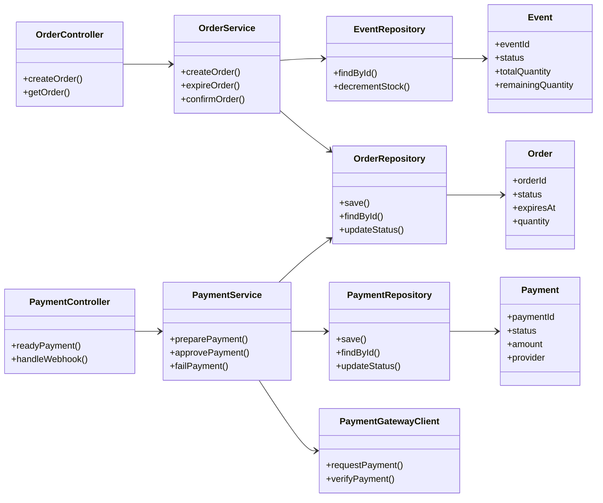

```mermaid
classDiagram
    direction LR

    %% ===== 애플리케이션 레이어 =====
    class OrderController {
        +createOrder()
        +getOrder()
    }

    class PaymentController {
        +readyPayment()
        +handleWebhook()
    }

    %% ===== 도메인 서비스 =====
    class OrderService {
        +createOrder()
        +expireOrder()
        +confirmOrder()
    }

    class PaymentService {
        +preparePayment()
        +approvePayment()
        +failPayment()
    }

    %% ===== 도메인 모델 =====
    class Event {
        +eventId
        +status
        +totalQuantity
        +remainingQuantity
    }

    class Order {
        +orderId
        +status
        +expiresAt
        +quantity
    }

    class Payment {
        +paymentId
        +status
        +amount
        +provider
    }

    %% ===== 인프라 =====
    class EventRepository {
        +findById()
        +decrementStock()
    }

    class OrderRepository {
        +save()
        +findById()
        +updateStatus()
    }

    class PaymentRepository {
        +save()
        +findById()
        +updateStatus()
    }

    class PaymentGatewayClient {
        +requestPayment()
        +verifyPayment()
    }

    %% ===== 관계 =====
    OrderController --> OrderService
    PaymentController --> PaymentService

    OrderService --> EventRepository
    OrderService --> OrderRepository

    PaymentService --> PaymentRepository
    PaymentService --> OrderRepository
    PaymentService --> PaymentGatewayClient

    EventRepository --> Event
    OrderRepository --> Order
    PaymentRepository --> Payment

```