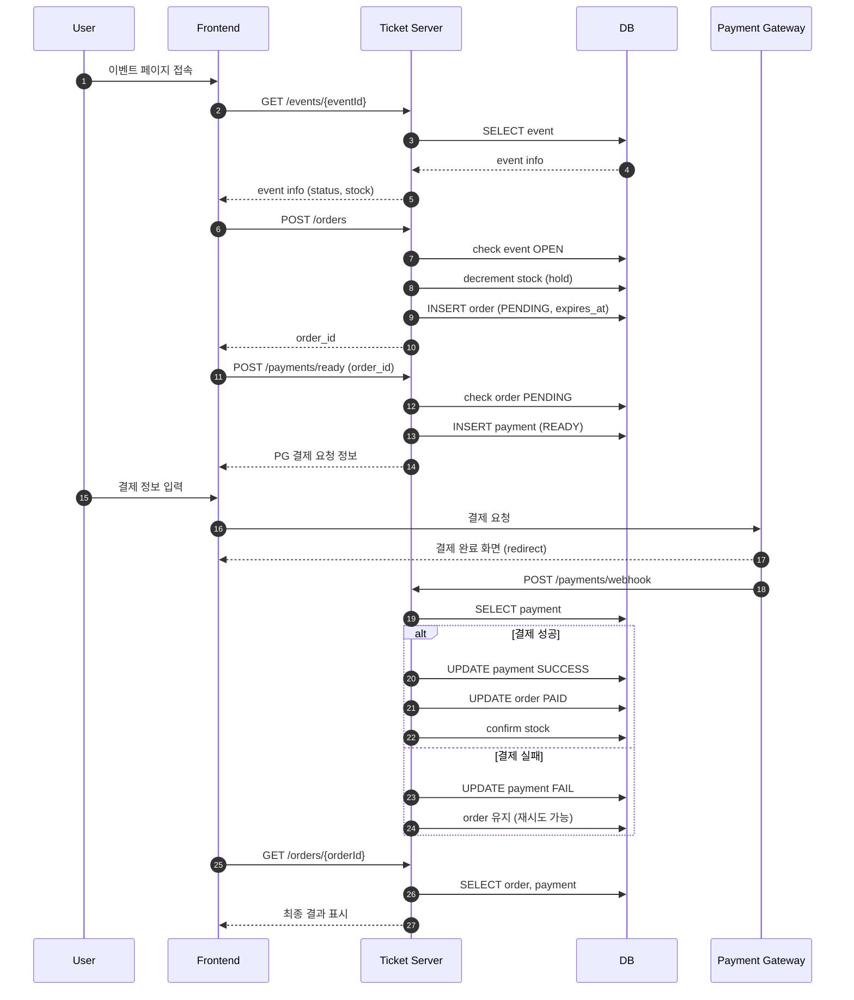

```mermaid
sequenceDiagram
    autonumber

    participant U as User
    participant FE as Frontend
    participant S as Ticket Server
    participant DB as DB
    participant PG as Payment Gateway

    %% 1. 이벤트 페이지 진입
    U ->> FE: 이벤트 페이지 접속
    FE ->> S: GET /events/{eventId}
    S ->> DB: SELECT event
    DB -->> S: event info
    S -->> FE: event info (status, stock)
    
    %% 2. order 생성 (재고 홀드)
    FE ->> S: POST /orders
    S ->> DB: check event OPEN
    S ->> DB: decrement stock (hold)
    S ->> DB: INSERT order (PENDING, expires_at)
    S -->> FE: order_id

    %% 3. 결제 준비 (READY)
    FE ->> S: POST /payments/ready (order_id)
    S ->> DB: check order PENDING
    S ->> DB: INSERT payment (READY)
    S -->> FE: PG 결제 요청 정보

    %% 4. PG 결제 (Blackbox)
    U ->> FE: 결제 정보 입력
    FE ->> PG: 결제 요청
    PG -->> FE: 결제 완료 화면 (redirect)

    %% 5. 결제 승인 Webhook
    PG ->> S: POST /payments/webhook
    S ->> DB: SELECT payment
    alt 결제 성공
        S ->> DB: UPDATE payment SUCCESS
        S ->> DB: UPDATE order PAID
        S ->> DB: confirm stock
    else 결제 실패
        S ->> DB: UPDATE payment FAIL
        S ->> DB: order 유지 (재시도 가능)
    end

    %% 6. 클라이언트 결과 확인
    FE ->> S: GET /orders/{orderId}
    S ->> DB: SELECT order, payment
    S -->> FE: 최종 결과 표시

```
