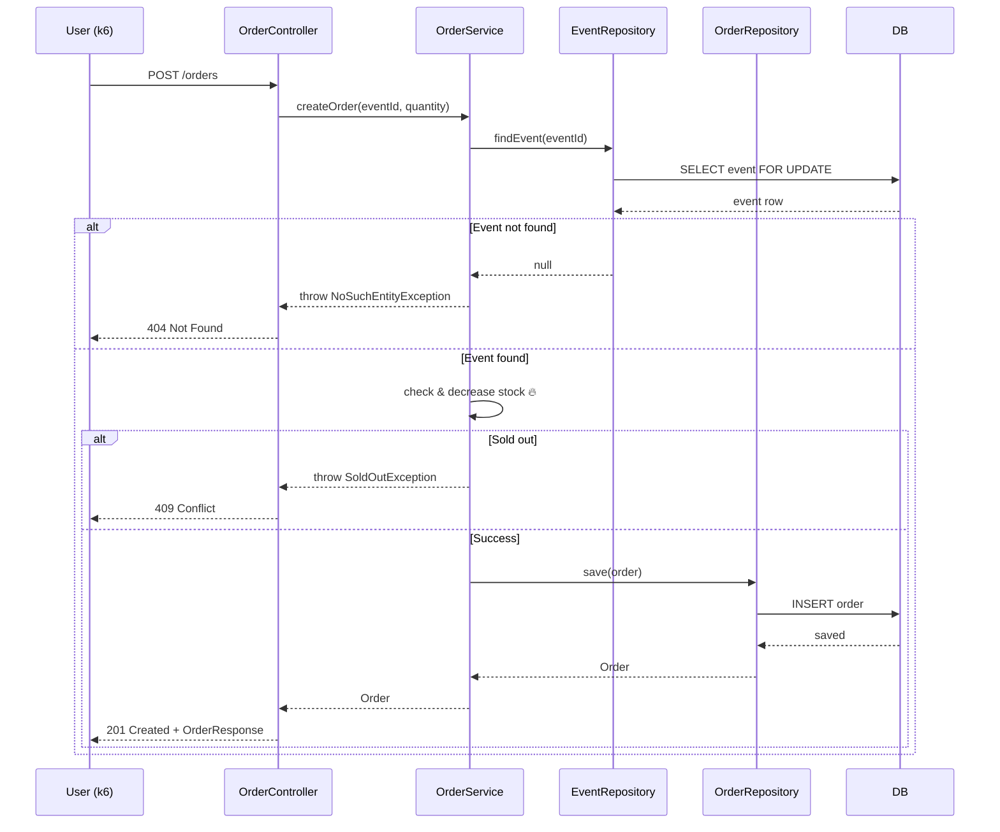
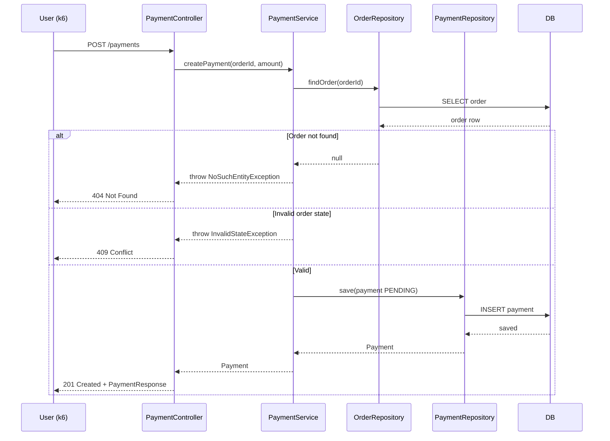
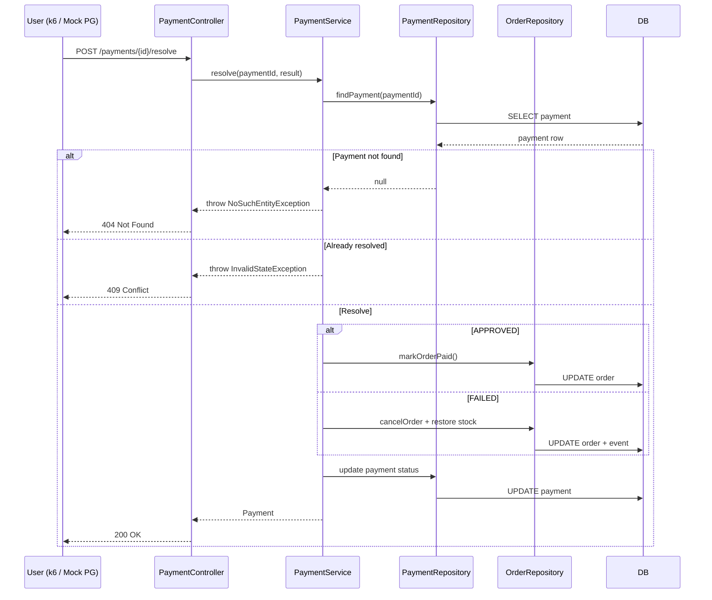
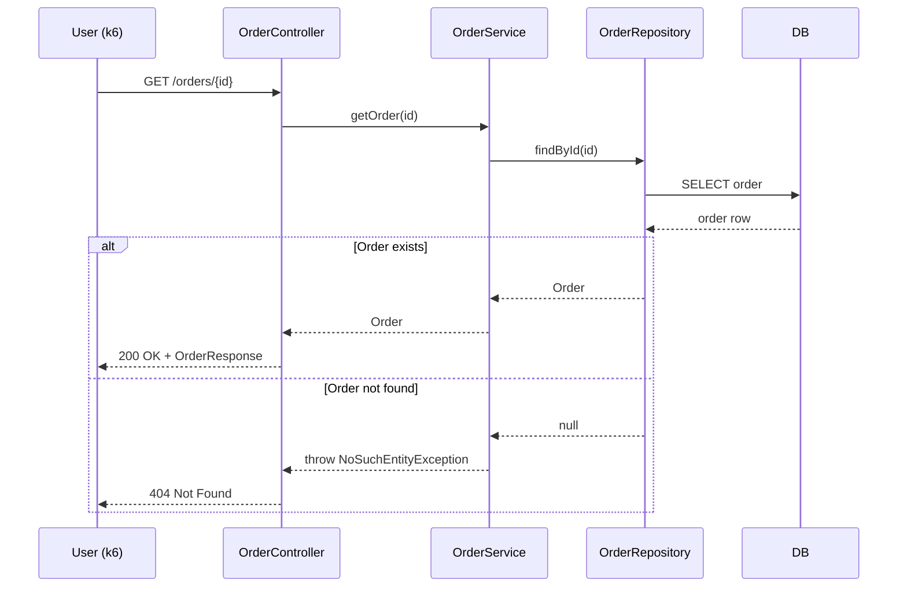

# GET /events/{id}

```mermaid
sequenceDiagram
    participant U as User (k6)
    participant EC as EventController
    participant ES as EventService
    participant ER as EventRepository
    participant DB as DB

    U->>EC: GET /events/{id}
    EC->>ES: getEvent(id)
    ES->>ER: findById(id)
    ER->>DB: SELECT event
    DB-->>ER: event row

    alt Event exists
        ER-->>ES: Event
        ES-->>EC: Event
        EC-->>U: 200 OK + EventResponse
    else Event not found
        ER-->>ES: null
        ES-->>EC: throw NoSuchEntityException
        EC-->>U: 404 Not Found
    end
```

---

# POST /orders (Hotspot)

```mermaid
sequenceDiagram
    participant U as User (k6)
    participant OC as OrderController
    participant OS as OrderService
    participant ER as EventRepository
    participant OR as OrderRepository
    participant DB as DB

    U->>OC: POST /orders
    OC->>OS: createOrder(eventId, quantity)

    OS->>ER: findEvent(eventId)
    ER->>DB: SELECT event FOR UPDATE
    DB-->>ER: event row

    alt Event not found
        ER-->>OS: null
        OS-->>OC: throw NoSuchEntityException
        OC-->>U: 404 Not Found
    else Event found
        OS->>OS: check & decrease stock 🔥

        alt Sold out
            OS-->>OC: throw SoldOutException
            OC-->>U: 409 Conflict
        else Success
            OS->>OR: save(order)
            OR->>DB: INSERT order
            DB-->>OR: saved

            OR-->>OS: Order
            OS-->>OC: Order
            OC-->>U: 201 Created + OrderResponse
        end
    end
```

---

# POST /payments

```mermaid
sequenceDiagram
    participant U as User (k6)
    participant PC as PaymentController
    participant PS as PaymentService
    participant OR as OrderRepository
    participant PR as PaymentRepository
    participant DB as DB

    U->>PC: POST /payments
    PC->>PS: createPayment(orderId, amount)

    PS->>OR: findOrder(orderId)
    OR->>DB: SELECT order
    DB-->>OR: order row

    alt Order not found
        OR-->>PS: null
        PS-->>PC: throw NoSuchEntityException
        PC-->>U: 404 Not Found
    else Invalid order state
        PS-->>PC: throw InvalidStateException
        PC-->>U: 409 Conflict
    else Valid
        PS->>PR: save(payment PENDING)
        PR->>DB: INSERT payment
        DB-->>PR: saved

        PR-->>PS: Payment
        PS-->>PC: Payment
        PC-->>U: 201 Created + PaymentResponse
    end
```

---

# POST /payments/{id}/resolve (Mock PG)

```mermaid
sequenceDiagram
    participant U as User (k6 / Mock PG)
    participant PC as PaymentController
    participant PS as PaymentService
    participant PR as PaymentRepository
    participant OR as OrderRepository
    participant DB as DB

    U->>PC: POST /payments/{id}/resolve
    PC->>PS: resolve(paymentId, result)

    PS->>PR: findPayment(paymentId)
    PR->>DB: SELECT payment
    DB-->>PR: payment row

    alt Payment not found
        PR-->>PS: null
        PS-->>PC: throw NoSuchEntityException
        PC-->>U: 404 Not Found
    else Already resolved
        PS-->>PC: throw InvalidStateException
        PC-->>U: 409 Conflict
    else Resolve
        alt APPROVED
            PS->>OR: markOrderPaid()
            OR->>DB: UPDATE order
        else FAILED
            PS->>OR: cancelOrder + restore stock
            OR->>DB: UPDATE order + event
        end

        PS->>PR: update payment status
        PR->>DB: UPDATE payment

        PS-->>PC: Payment
        PC-->>U: 200 OK
    end
```

---

# GET /orders/{id}

```mermaid
sequenceDiagram
    participant U as User (k6)
    participant OC as OrderController
    participant OS as OrderService
    participant OR as OrderRepository
    participant DB as DB

    U->>OC: GET /orders/{id}
    OC->>OS: getOrder(id)
    OS->>OR: findById(id)
    OR->>DB: SELECT order
    DB-->>OR: order row

    alt Order exists
        OR-->>OS: Order
        OS-->>OC: Order
        OC-->>U: 200 OK + OrderResponse
    else Order not found
        OR-->>OS: null
        OS-->>OC: throw NoSuchEntityException
        OC-->>U: 404 Not Found
    end
```