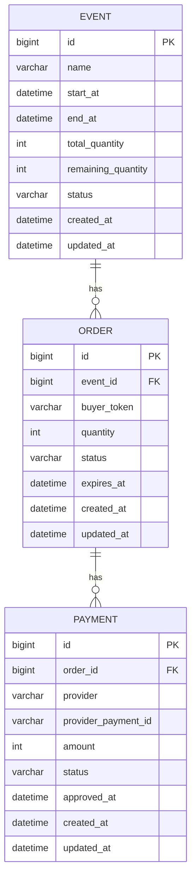

```mermaid
erDiagram
    EVENT ||--o{ ORDER : has
    ORDER ||--o{ PAYMENT : has

    EVENT {
        bigint id PK
        varchar name
        datetime start_at
        datetime end_at
        int total_quantity
        int remaining_quantity
        varchar status
        datetime created_at
        datetime updated_at
    }

    ORDER {
        bigint id PK
        bigint event_id FK
        varchar buyer_token
        int quantity
        varchar status
        datetime expires_at
        datetime created_at
        datetime updated_at
    }

    PAYMENT {
        bigint id PK
        bigint order_id FK
        varchar provider
        varchar provider_payment_id
        int amount
        varchar status
        datetime approved_at
        datetime created_at
        datetime updated_at
    }

```